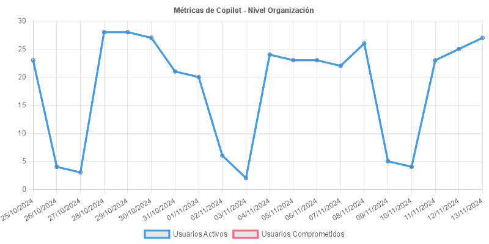
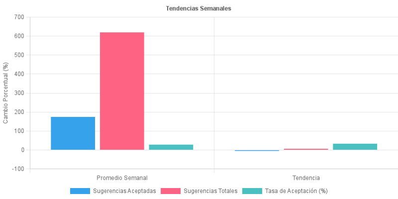

# GitHub Copilot Metrics API

This API provides endpoints to retrieve GitHub Copilot usage metrics at different organizational levels. This app utilizes the [GitHub Copilot Metrics API](https://docs.github.com/en/enterprise-cloud@latest/rest/copilot/copilot-usage?apiVersion=2022-11-28) to fetch and visualize Copilot metrics.


## Author and Maintainers

This project is developed and maintained by:

**I+D Tech (Primary)**  
[primary.com.ar](https://primary.com.ar/)

## Setup and Installation

### Using Docker (Recommended)

1. Clone the repository
2. Create a `.env` file in the root directory using `.env.example` as a template:
```bash
cp .env.example .env
```
Then edit `.env` with your values:
   - GITHUB_TOKEN: Your GitHub personal access token
   - ENTERPRISE: Your enterprise name
   - ORG: Your organization name
   - TEAM_SLUG: Your team slug
   - API_VERSION: GitHub API version (defaults to 2022-11-28)

3. Build and start the containers:
```bash
docker-compose up --build
```

The services will be available at:
- Frontend: http://localhost:8080
- Backend API: http://localhost:3000

To stop the services:
```bash
docker-compose down
```

### Manual Setup

1. Clone the repository
2. Install dependencies:
```bash
npm install
```
3. Configure the environment as described above
4. Start the server:
```bash
npm start
```

The API will be available at: http://localhost:3000

## API Documentation

The API includes a Swagger UI interface for easy testing and documentation:

1. Start the server:
```bash
npm start
```

2. Access the Swagger UI at: http://localhost:3000/api-docs

The Swagger interface allows you to:
- View detailed API documentation
- Test endpoints directly from the browser
- See request/response schemas
- Authenticate using your GitHub token
- Download response examples

## API Endpoints

All endpoints are prefixed with the base URL: `http://localhost:3000`

### Metrics Refresh

#### Get Updated Metrics
```http
GET /metrics/refresh
```
Fetches the most recent Copilot metrics, generates charts, and exports the data to both PNG and JSON files. This endpoint provides a convenient way to get fresh metrics data and automatically generate all associated files.

Returns the same structure as other metrics endpoints, including:
- Raw metrics data
- Formatted chart data
- Statistical summary
- Generated chart information
- Export file information

### Enterprise Level Metrics

#### Get Enterprise Metrics
```http
GET /enterprise/metrics
```
Returns Copilot usage metrics for the entire enterprise.

#### Get Enterprise Team Metrics
```http
GET /enterprise/team/metrics
```
Returns Copilot metrics for a specific team within the enterprise.

### Organization Level Metrics

#### Get Organization Metrics
```http
GET /org/metrics
```
Returns Copilot usage metrics for the entire organization.

#### Get Organization Team Metrics
```http
GET /org/team/metrics
```
Returns Copilot metrics for a specific team within the organization.

Each endpoint will:
1. Return JSON data with metrics
2. Generate and save a PNG chart in the exports directory
3. Export the full data as JSON in the exports directory

## Export Format

All endpoints automatically export their data in two formats in the `exports` directory:

1. PNG chart images with format: `copilot-metrics-YYYY-MM-DDTHH-mm-ss.png`
2. JSON data files with format: `copilot-metrics-[type]-YYYY-MM-DD-YYYY-MM-DDTHH-mm-ss.json`

Where:
- `[type]` is one of: enterprise, enterprise-team, organization, organization-team
- The date (YYYY-MM-DD) helps with file organization
- The timestamp (HH-mm-ss) ensures unique filenames

## Response Format

All endpoints return JSON responses with the following structure:

```json
{
    "raw": {
        // Raw metrics data from GitHub API
    },
    "chartData": {
        "labels": ["01/01/2024", "02/01/2024", ...],
        "datasets": [
            {
                "label": "Sugerencias Aceptadas",
                "data": [100, 150, ...],
                "borderColor": "#36A2EB",
                "fill": false
            },
            {
                "label": "Sugerencias Totales",
                "data": [200, 250, ...],
                "borderColor": "#FF6384",
                "fill": false
            }
        ]
    },
    "summary": {
        "overall": {
            "totalAcceptedSuggestions": 1000,
            "totalSuggestions": 2000,
            "acceptanceRate": "50.00",
            "activeUsers": 50
        },
        "weeklyAverages": {
            "acceptedSuggestions": "145.50",
            "totalSuggestions": "290.75",
            "acceptanceRate": "50.04"
        },
        "trends": {
            "acceptedSuggestions": 5.2,
            "totalSuggestions": 3.8,
            "trend": "Ligero incremento"
        },
        "lastUpdate": "2024-01-15"
    },
    "chart": {
        "success": true,
        "filePath": "exports/copilot-metrics-2024-01-15T12-30-45.png",
        "fileName": "copilot-metrics-2024-01-15T12-30-45.png"
    }
}
```

The `chartData` object is formatted for use with chart libraries like Chart.js. The API automatically generates and saves chart images in PNG format in the `exports` directory.

## Example Chart Outputs

The API generates several types of chart visualizations that are saved as PNG files in the `exports` directory:

### Summary Chart

This chart shows an overview of key Copilot metrics including active users and engagement rates.

### Trends Chart

This visualization displays weekly trends and acceptance rates over time.

## Error Handling

The API uses standard HTTP response codes:
- 200: Success
- 400: Bad Request
- 401: Unauthorized
- 403: Forbidden
- 404: Not Found
- 500: Internal Server Error

## Authentication

All requests require proper GitHub authentication headers.

## AI-Assisted Development

This project was developed with the assistance of:
- [Aider](https://aider.chat), an AI pair programming tool
- Model: [Anthropic Claude 3.5 Sonnet](https://www.anthropic.com/claude)

The use of these AI tools helped streamline development while maintaining code quality and best practices.
